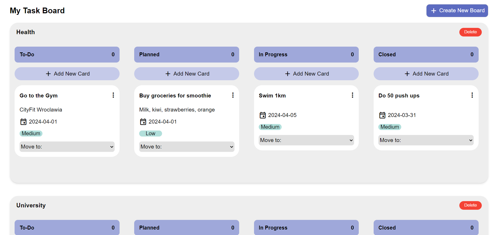
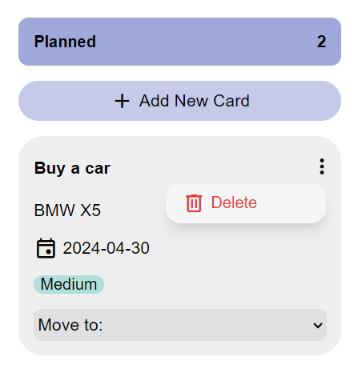

# Task Management System

## Description

Task Management System is a full-stack web application built with React, NestJS, and PostgreSQL.
It consists of two main folders: backend and frontend.
The backend is developed using NestJS, providing RESTful APIs to interact with the PostgreSQL database.
The frontend is built with React, offering a user-friendly interface to interact with the application's features.

## Features

- **All tasks are distributed between To-Do, In Progress, Planned and Closed folders**
  
  

- **When adding a task user can specify its title, status, due date, priority and description**

  

- **User can delete a task**

  

## Installation

To run Your Application Name locally on your computer, follow these steps:

### Prerequisites

- Node.js installed on your machine
- PostgreSQL installed and running
- npm or yarn package manager installed

### Backend Setup

1. Navigate to the `backend` folder.
2. Install dependencies by running: ```npm i --force```
3. 4. Install TypeORM by running: ```npm install -g typeorm```
4. Install Database by running ```npm run typeorm migration:run```
5. Run Backend by running: ```npm run start:dev```


### Run Frontend
1. Navigate to the `frontend` folder.
2. Install dependencies by running: ```npm i --force```
3. Run Backend by running: ```npm run dev```

## Usage
Once both the backend and frontend servers are running, you can access Your Application Name by navigating to `http://localhost:3000` in your web browser.
From there, you can start using the application's features.
   
